# 🚀 BLH Homepage 자동 배포 가이드

이 문서는 BLH Homepage의 자동 배포 시스템 설정 및 사용 방법을 설명합니다.

## 📋 목차

1. [시스템 개요](#시스템-개요)
2. [GitHub 설정](#github-설정)
3. [Docker Hub 설정](#docker-hub-설정)
4. [자동 배포 워크플로우](#자동-배포-워크플로우)
5. [수동 배포](#수동-배포)
6. [문제 해결](#문제-해결)

## 🔧 시스템 개요

### 자동화된 CI/CD 파이프라인

```mermaid
graph LR
    A[코드 푸시] --> B[GitHub Actions]
    B --> C[테스트 실행]
    C --> D[Docker 빌드]
    D --> E[Docker Hub 푸시]
    E --> F[배포 스크립트 생성]
    F --> G[배포 완료]
```



### 주요 기능

- ✅ **자동 테스트**: 코드 푸시 시 자동으로 테스트 실행
- 🐳 **Docker 빌드**: 멀티 아키텍처 지원 (AMD64, ARM64)
- 📦 **자동 배포**: Docker Hub에 자동 업로드
- 🔄 **버전 관리**: 타임스탬프 및 커밋 해시 기반 태깅
- 📊 **모니터링**: 헬스체크 및 배포 상태 확인

## ⚙️ GitHub 설정

### 1. 저장소 시크릿 설정

GitHub 저장소의 **Settings > Secrets and variables > Actions**에서 다음 시크릿을 추가하세요:

| 시크릿 이름 | 설명 | 예시 |
|------------|------|------|
| `DOCKER_USERNAME` | Docker Hub 사용자명 | `wecarmobility` |
| `DOCKER_PASSWORD` | Docker Hub 액세스 토큰 | `dckr_pat_xxxxx` |

### 2. Docker Hub 액세스 토큰 생성

1. [Docker Hub](https://hub.docker.com)에 로그인
2. **Account Settings > Security > Access Tokens**
3. **New Access Token** 클릭
4. 토큰 이름 입력 (예: `blh-homepage-ci`)
5. 권한 선택: **Read, Write, Delete**
6. 생성된 토큰을 `DOCKER_PASSWORD`로 저장

### 3. 저장소 권한 설정

**Settings > Actions > General**에서:
- ✅ **Allow all actions and reusable workflows**
- ✅ **Read and write permissions**
- ✅ **Allow GitHub Actions to create and approve pull requests**

## 🐳 Docker Hub 설정

### 저장소 생성

1. [Docker Hub](https://hub.docker.com)에서 새 저장소 생성
2. 저장소 이름: `blh-homepage`
3. 가시성: **Public** 또는 **Private**
4. 설명 추가 (선택사항)

## 🔄 자동 배포 워크플로우

### 트리거 조건

자동 배포는 다음 조건에서 실행됩니다:

- ✅ `main` 또는 `master` 브랜치에 푸시
- ✅ Pull Request 생성 (테스트만 실행)

### 배포 단계

1. **테스트 단계**
   ```yaml
   - Python 환경 설정
   - 의존성 설치
   - 기본 테스트 실행
   ```

2. **빌드 및 푸시 단계**
   ```yaml
   - Docker Buildx 설정
   - 멀티 아키텍처 빌드
   - Docker Hub 푸시
   - 태그 생성 (latest, timestamp, commit-hash)
   ```

3. **배포 단계**
   ```yaml
   - 배포 스크립트 생성
   - 아티팩트 업로드
   - 배포 정보 요약
   ```

### 생성되는 Docker 태그

| 태그 형식 | 예시 | 설명 |
|-----------|------|------|
| `latest` | `wecarmobility/blh-homepage:latest` | 최신 안정 버전 |
| `타임스탬프` | `wecarmobility/blh-homepage:20251006-191257` | 빌드 시간 기반 |
| `커밋해시` | `wecarmobility/blh-homepage:a1b2c3d` | Git 커밋 기반 |

## 🛠️ 수동 배포

### 로컬 배포

```bash
# 로컬에서 빌드하여 배포
./deploy.sh local

# 프로덕션 이미지로 배포
./deploy.sh production
```

### Docker Compose 배포

```bash
# 서비스 시작
docker-compose up -d

# 서비스 중지
docker-compose down

# 로그 확인
docker-compose logs -f
```

### 직접 Docker 명령어

```bash
# 최신 이미지 다운로드
docker pull wecarmobility/blh-homepage:latest

# 컨테이너 실행
docker run -d \
  --name blh-homepage-container \
  -p 3001:3001 \
  --restart unless-stopped \
  wecarmobility/blh-homepage:latest
```

## 📊 모니터링 및 관리

### 헬스체크

```bash
# 서비스 상태 확인
curl http://localhost:3001/health

# 응답 예시
{
  "status": "healthy",
  "timestamp": "2025-10-06T10:13:46.064632",
  "version": "1.0.0"
}
```

### 로그 확인

```bash
# 실시간 로그 확인
docker logs -f blh-homepage-container

# 최근 100줄 로그
docker logs --tail 100 blh-homepage-container
```

### 컨테이너 관리

```bash
# 컨테이너 상태 확인
docker ps --filter "name=blh-homepage-container"

# 컨테이너 재시작
docker restart blh-homepage-container

# 컨테이너 중지
docker stop blh-homepage-container

# 컨테이너 제거
docker rm blh-homepage-container
```

## 🔧 문제 해결

### 일반적인 문제들

#### 1. Docker Hub 푸시 실패

**증상**: `push access denied` 오류

**해결책**:
```bash
# Docker Hub 로그인 확인
docker login

# 토큰 권한 확인 (Read, Write, Delete 필요)
# GitHub Secrets 재설정
```

#### 2. 컨테이너 시작 실패

**증상**: 컨테이너가 즉시 종료됨

**해결책**:
```bash
# 로그 확인
docker logs blh-homepage-container

# 포트 충돌 확인
lsof -i :3001

# 권한 문제 확인
ls -la instance/ static/uploads/
```

#### 3. 헬스체크 실패

**증상**: 헬스체크 엔드포인트 응답 없음

**해결책**:
```bash
# 컨테이너 내부 확인
docker exec -it blh-homepage-container bash

# 프로세스 확인
docker exec blh-homepage-container ps aux

# 네트워크 확인
docker exec blh-homepage-container netstat -tlnp
```

### 긴급 복구

#### 이전 버전으로 롤백

```bash
# 이전 태그로 배포
docker pull wecarmobility/blh-homepage:20251006-191257
docker stop blh-homepage-container
docker rm blh-homepage-container
docker run -d --name blh-homepage-container -p 3001:3001 \
  wecarmobility/blh-homepage:20251006-191257
```

#### 완전 초기화

```bash
# 모든 관련 컨테이너 및 이미지 제거
docker stop blh-homepage-container
docker rm blh-homepage-container
docker rmi $(docker images wecarmobility/blh-homepage -q)

# 새로 배포
./deploy.sh production
```

## 📞 지원

문제가 지속되거나 추가 도움이 필요한 경우:

1. **GitHub Issues**: 버그 리포트 및 기능 요청
2. **로그 수집**: 문제 발생 시 관련 로그 첨부
3. **환경 정보**: OS, Docker 버전, 네트워크 설정 등

---

## 📝 변경 이력

| 버전 | 날짜 | 변경사항 |
|------|------|----------|
| 1.0.0 | 2025-10-06 | 초기 CI/CD 파이프라인 구축 |

---

**🎉 Happy Deploying!** 🚀
